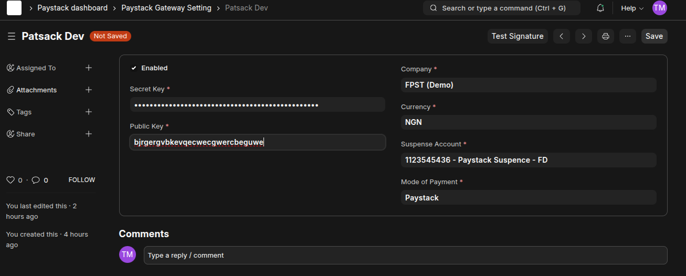
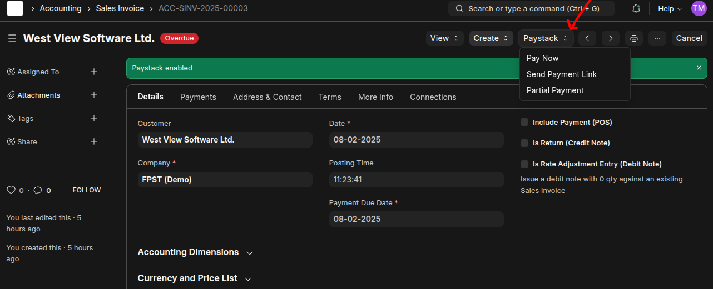
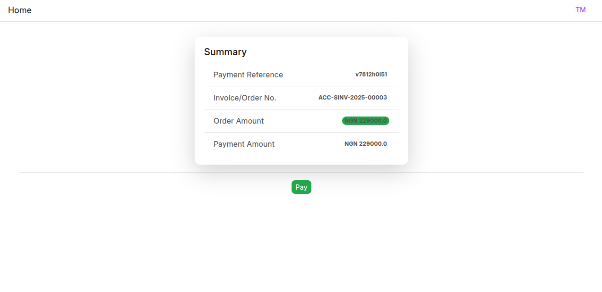
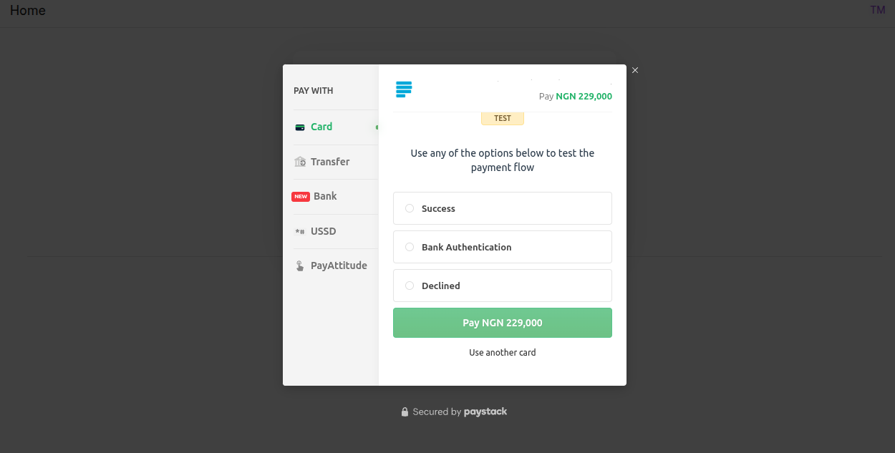
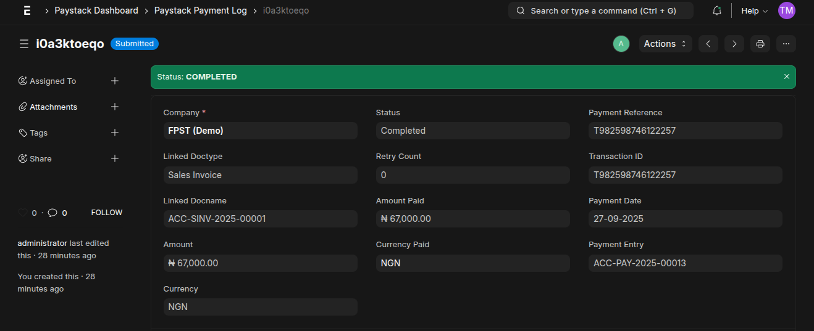

# Frappe Paystack Integration

**Frappe Paystack** is a seamless payment gateway integration for Frappe Framework and ERPNext that enables businesses to accept payments via [Paystack](https://paystack.com).

---

## Key Features

- **Partial Payments**: Accept partial payments against Sales Invoices or Sales Orders.
- **Payment Links via Email**: Generate and send payment links to customers via email.
- **Payment Validation**: Real-time verification of transaction status to prevent fraud and ensure accuracy.
- **Payment Logs**: Logs Payment Data.
- **Payment Reconciliation**: Auto-complete Sales Invoices or Sales Orders upon successful payment.
- **Reports**: reports for tracking Paystack transactions.

---

## Installation & Setup

Follow these steps to install and configure the Frappe Paystack app in your ERPNext/Frappe instance.

### 1. Install the App

```bash
bench get-app frappe_paystack https://github.com/mymi14s/frappe_paystack
```

### 2. Install on Your Site

Replace `your-site` with the name of your actual site:

```bash
bench --site your-site install-app frappe_paystack
```

### 3. Run Migrations

Apply database schema changes:

```bash
bench migrate
```

### 4. Configure Paystack Gateway Settings

1. Log in to your ERPNext/Frappe instance as a System Manager.
2. Go to **Paystack Gateway Setting** (under **Accounts > Payment Gateways**).
3. Obtain your **Public Key** and **Secret Key** from the [Paystack Dashboard](https://dashboard.paystack.com/#/settings/developers).
4. Set web hook in paystack https://yoursite.com/api/method/frappe_paystack.api.paystack_webhook
5. Enter the keys in the respective fields.
6. Set a **Suspense Account** (used to temporarily hold funds before reconciliation).
7. Select a **Mode of Payment** linked to Paystack.
8. **Enable** the gateway and click **Save**.



> Ensure your Paystack account is verified and active before going live.

### 5. Start Accepting Payments

- Open any **Sales Invoice** or **Sales Order**.
- Click the **Payment** button.
- Choose **Paystack** as the payment method.
- The system will generate a payment link and optionally email it to the customer.
- Upon successful payment, the document will be automatically marked as **Paid** (or partially paid, if applicable).


--------------------------------


---


---


---

## Reports

Access transaction insights via:
- **Paystack Transactions**: View all payment with status, amount, reference, and timestamp.
- **Customer Volume**: See total transactions for each customer.

---

## Support & Contributions

For issues, feature requests, or contributions, please visit the [GitHub repository](https://github.com/mymi14s/frappe_paystack).

---

> **Note**: Always test in **Paystack Test Mode** before enabling live transactions.

#### License

mit
